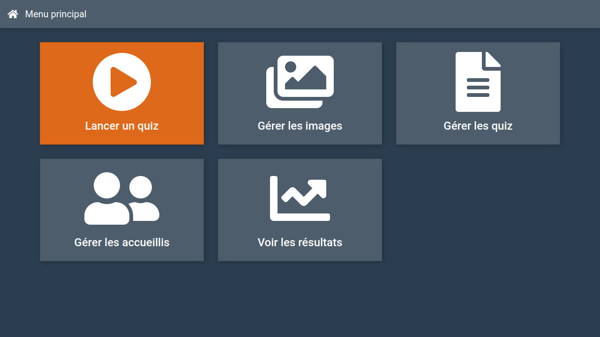

# PolyQuiz

**Course:** Sixth Semester Project

**Supervisors:** A.-M. Dery, R. Pourtier, M. Cousté, N. Stadler, C. Brel, G. Casagrande

**Date:** March 2020 - May 2020

## Description

PolyQuiz is an application whose purpose is to stimulate users' memory through the help of quizzes. It is aimed at the elderly and patients suffering from Alzheimer's disease. It is also intended for caregivers who can configure a user's profile according to their level of disability and create custom quizzes for specific patients. The front-end application was built using Angular, Angular Material and Bootstrap. The back-end application was conceived using Node, Express and Sequelize.

## Usage

1. [Linux](docs/linux) (Recommended)
2. [Windows](docs/windows)
3. [Mac OS](https://youtu.be/dQw4w9WgXcQ)

## Structure

- [client](client): The front-end application (Angular, Bootstrap...).
- [server](server): The back-end application (Node, Express, Sequelize...).

## Authors

- [João Brilhante](https://github.com/JoaoBrlt)
- [Martin Bouteiller](https://github.com/mbouteiller)
- [Olivier Doussaud](https://github.com/Dawwen)
- [Valentin Roccelli](https://github.com/RoccelliV)

## License

This project is licensed under the GPLv3 License - see the [LICENSE.md](LICENSE.md) file for details.
