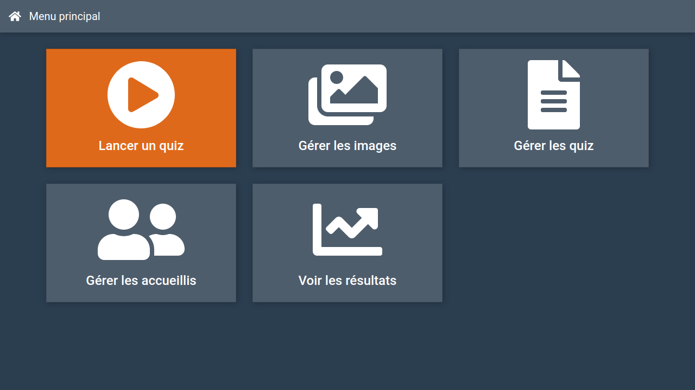

# PolyQuiz : Client application

The PolyQuiz client application.



## Requirements

1. Install Node 12+.

```bash
nvm use 
```

2. Install the dependencies.

```bash
npm install
```

3. Set up a PostgreSQL database.

4. Set up the [server application](../server).

6. *(Optional)* Update the [environment configuration](src/environments).

## Usage

- Run the client for development.

```bash
npm start
```

- Build the client for production.

```bash
npm run build
```

## Authors

- [João Brilhante](https://github.com/JoaoBrlt)
- [Martin Bouteiller](https://github.com/mbouteiller)
- [Olivier Doussaud](https://github.com/Dawwen)
- [Valentin Roccelli](https://github.com/RoccelliV)
